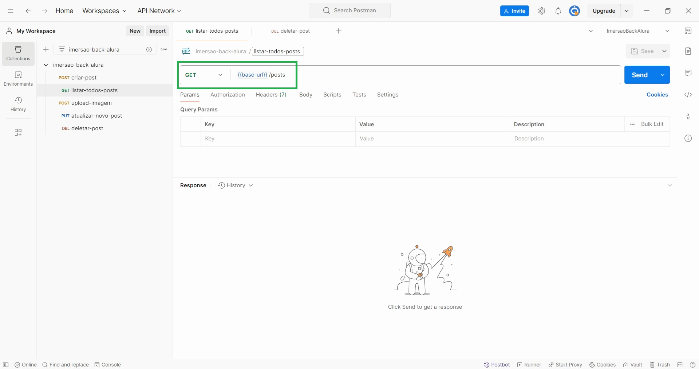

# AULA 5 (22 nov. 2024)

## 📖 Introdução
Nesta última aula, vamos finalizar o projeto, colocando a lógica de armazenamento de imagens no servidor, integrando o Front-End do projeto e, fazendo o deploy do back-end na Google Cloud.

**Nesta aula, você vai:**
- Fazer a lógica de armazenamento de imagens no servidor;
- Criar a rota PUT para atualização de post;
- Integrar com o Frontend;
- Integrar com a API do Gemini;
- Fazer o deploy do back-end na Google Cloud.

<br></br>
## 📝 Anotações
## CORS
Por questão de segurança, os navegadores bloqueiam requisições de outros endereços de IP. Para informar que ele receberá requisições de um local diferente do localhost:3000 usa-se o CORS.

No arquivo de postRoutes foi inserido o seguinte código:
```javascript
const corsOptions = {
    origin: "http://localhost:8000", // endereço em que o front está rodando
    optionsSuccessStatus: 200
}
```
O código acima informa ao backend (que roda no localhost:3000) que ele receberá requisições do frontend (que roda no localhost:8000).

💡 Conteúdo relacionado disponível <a href="https://www.alura.com.br/artigos/como-resolver-erro-de-cross-origin-resource-sharing">aqui</a>.

<br></br>
## 🎯 Exercício sugerido pela Luri ao final da aula

**Que tal fazer um exercício onde você cria uma nova rota para deletar um post existente?**

1. Crie uma nova rota: Adicione uma rota DELETE /posts/:id no seu servidor para permitir a exclusão de um post pelo seu ID.

2. Implemente a função: No seu controller, crie uma função chamada deletarPost que utiliza o método deleteOne do MongoDB para remover o post do banco de dados.

3. Teste a rota: Use o Postman para testar a nova rota, enviando uma requisição DELETE para a URL correspondente ao ID de um post que você deseja excluir.

4. Retorne uma resposta: Certifique-se de que a função retorna uma resposta adequada, como uma mensagem de sucesso ou erro, dependendo do resultado da operação.

💡 Veja a solução do exercício abaixo:<br></br>
